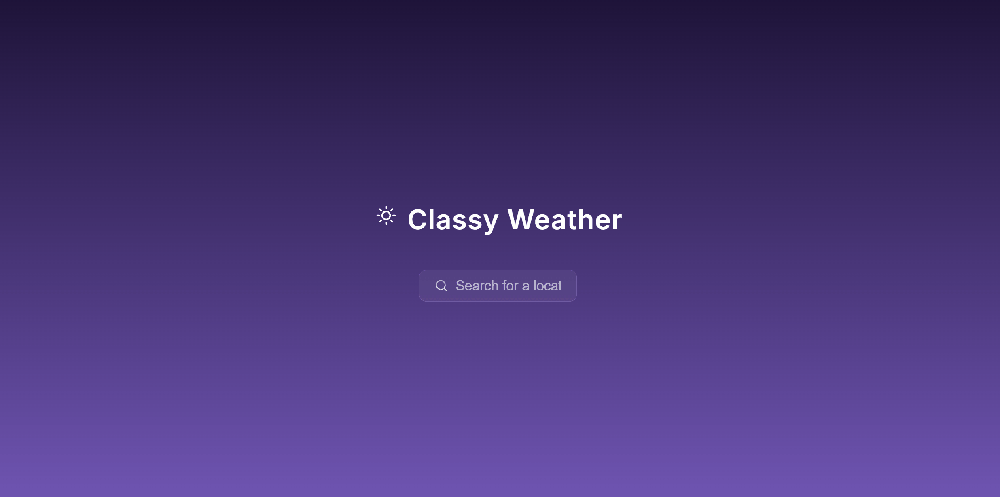

# 🏃‍➡️ React Mini Projects

This repository showcases my learning journey with ReactJS.  
Each subfolder contains a self-contained mini project demonstrating different ReactJS concepts and techniques.

---

## 👀 Live Demos

### 🌦️ Classy Weather  
Weather forecast app built to understand how class components differ from functional components.  

🔗 **Live Demo:** [classy-weather-luther.netlify.app](https://classy-weather-luther.netlify.app)  

---

### 💸 useReducer Bank Account  
A small banking simulation project built to practice the `useReducer` hook for complex state management.  

🔗 **Live Demo:** [usereducer-bank-account-luther.netlify.app](https://usereducer-bank-account-luther.netlify.app)  

