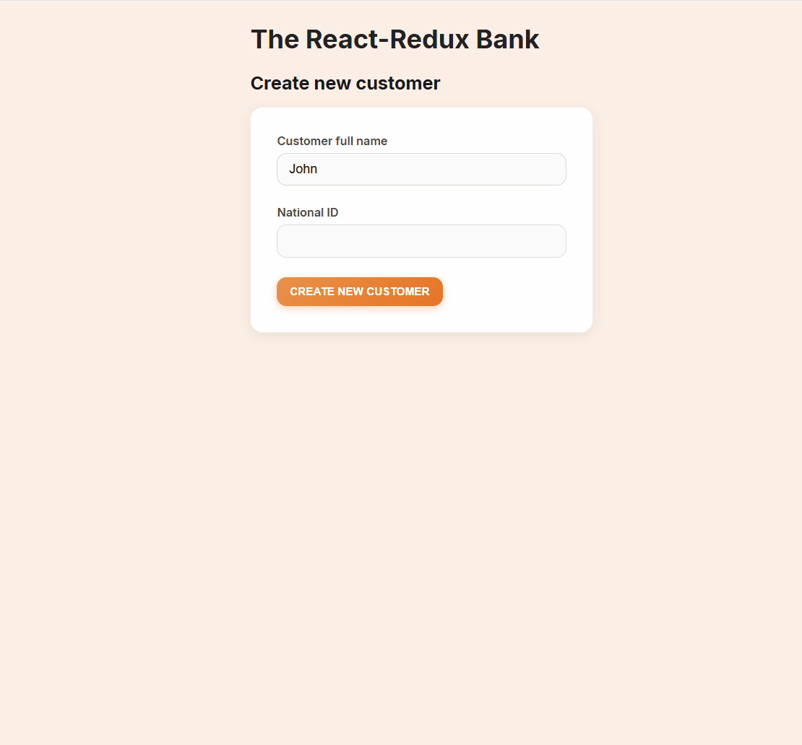
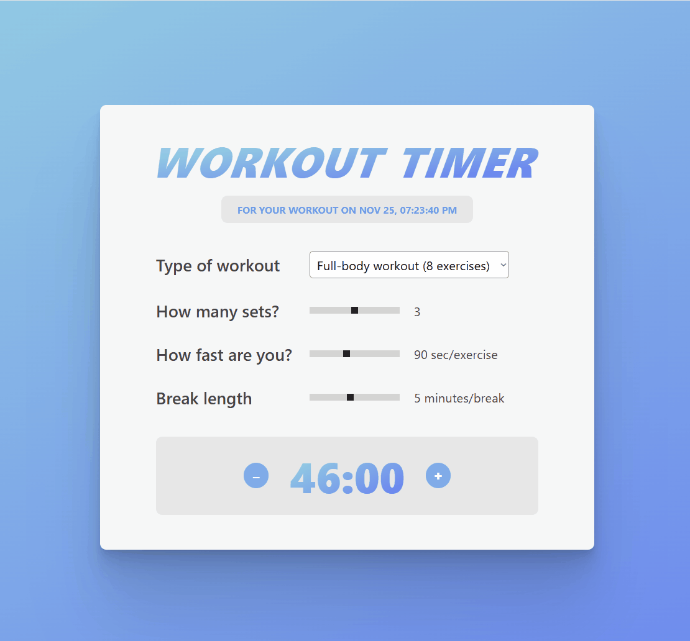

# 🏃‍➡️ React Mini Projects

This repository showcases my learning journey with ReactJS.  
Each subfolder contains a self-contained mini project demonstrating different ReactJS concepts and techniques.

🚧 *This project is currently in development.*

*This repository is part of an ongoing React learning and experimentation phase.  
Expect frequent updates and iterative improvements.*

---

## 👀 Live Demos

### 🌦️ Classy Weather  
Weather forecast app built to understand how class components differ from functional components.  

🔗 **Live Demo:** [classy-weather-luther.netlify.app](https://classy-weather-luther.netlify.app)  


---

### 🏧 Redux Intro
A banking app to practice legacy Redux and modern Redux Toolkit.

🔗 **Live Demo:** [redux-intro-luther.netlify.app](https://redux-intro-luther.netlify.app)



---

### 🏋️ Workout Timer
Workout Timer app with sound interaction to better understand useEffect hook.

🔗 **Live Demo:** [workout-timer-luther.netlify.app](https://workout-timer-luther.netlify.app)



---

### 💸 useReducer Bank Account  
A small banking simulation project built to practice the `useReducer` hook for complex state management.  

🔗 **Live Demo:** [usereducer-bank-account-luther.netlify.app](https://usereducer-bank-account-luther.netlify.app)  


---

## 📑 Commit Message Convention
Starting 29/10/2025, this repository follows the Conventional Commits format for better clarity.

### Format
Project specific commit
````
<type>(project/scope): <short summary>
````
Repo-level commit
````
<type>(scope): <short summary>
````
### Examples
````
feat(weather-app/ui): add CityList component
fix(weather-app/styles): remove white scrollbar from sidebar
refactor(weather-app/context): simplify CityContext reducer logic
docs(weather-app/readme): update setup instructions
docs(repo): update README with list of mini projects
````
### Common Types
| Type       | Description                                 |
| ---------- | ------------------------------------------- |
| `feat`     | New feature or component                    |
| `fix`      | Bug fix or patch                            |
| `refactor` | Code restructure without behavior change    |
| `style`    | Styling or formatting only                  |
| `docs`     | Documentation updates                       |
| `chore`    | Maintenance, tooling, or dependency changes |
| `test`     | Adding or updating tests                    |

Earlier commits may use simpler messages (e.g., “Added sidebar component”) before adopting this standard, reflecting the project’s evolution toward professional Git workflows.
